# Guide to create node.js backend and mysql database with docker

## The total process in a nutshell
- To create a backend software from the beginning, one should follow next steps:
- 1. Database can be installed locally on pc or by using Docker. In this example, i will first make a docker-compose.yaml file and run it only to make a database, and later enlarge the compose file to also contain the node application.
- 2. The code of application must be made first. The development is not done inside a container. When code is updated, a new container must be made and old one deleted.
- 3. After application is enough to start running, update the docker-compose.yaml file to also contain the node application.
- 4. Please note that we could also do the development with separate Dockerfiles. But using compose is more common in the industry. The benefitg of separate Dockerfiles would be that we could clearly make a separate database and a separate node application or any other application. Personally i favor separate files at least for the initial development phase, and just connecting the separate containers into same Docker network, but for this demo project i will immediately use the docker-compose.yaml file.

## step 1: creating the database using docker-compose.yaml
- At this first phase, I will create a simple MySQL database using docker-compose.yaml. 
- image will select the latest mysql version
- container_name helps to access via command panel
- environment defines the environmental variables
- ports are used that way first port is host machine, second is db itself
- volume defines a permanent storage for data
- and the docker-entrypoint-initdb command runs the database.sql file allowing to create needed tables automatically for the container
- Here is image of database.sql content:
  
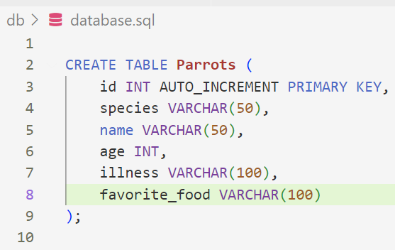

- And here is image of the docker-compose.yaml file content so far:
  
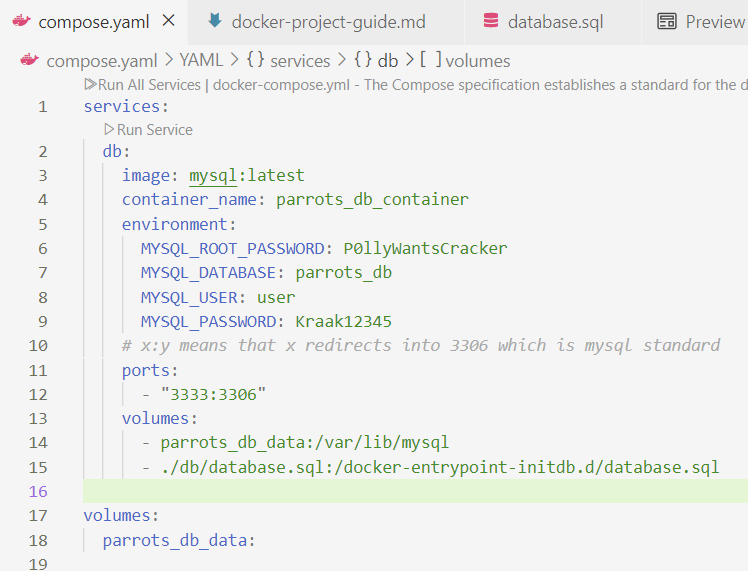

- Now we go to see inside the docker whether the datatable has been created (use command panel that can be in interactive mode, e.g windows cmd rather than git bash):

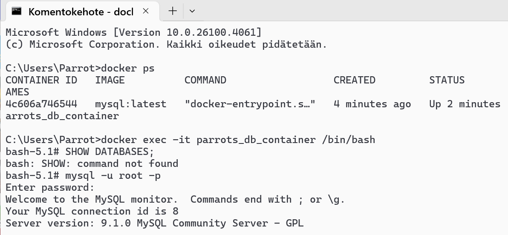 
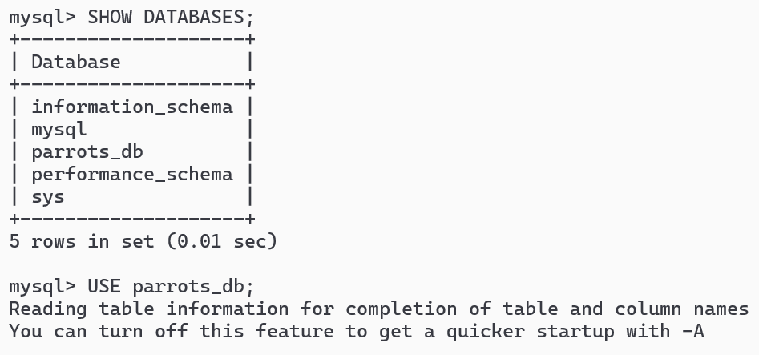 
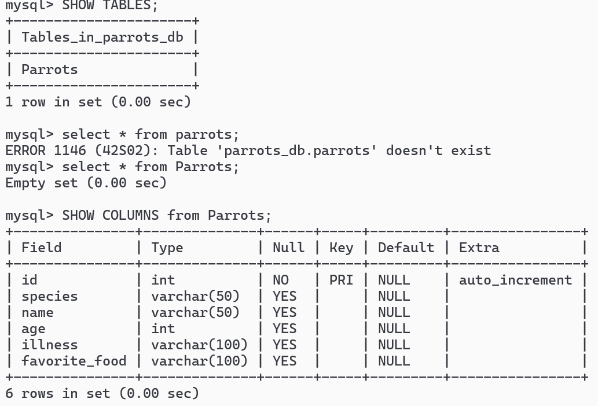

## step 2: installing node to system
- The system must have node installed.
- Node is a library, that allows running javascript in the backend.
- It also contains the npm, which is a package manager system.
- For this project i use Node version 22.11 LTS, but other 22 is also ok
- https://nodejs.org/en/download/

## step 3: installing node dependencies
- This demo backend is quite simple. It has connection to MySQL database, and CRUD operators for parrots.
- To create the backend, start by going with git bash command panel to a suitable folder. Make sure to use a separate and clearly named folder. Then run next commands:
- "npm init -y"
- "npm install express mysql dotenv nodemon helmet"
- express is a lightweight backend, mysql library is needed to support mysql
- dotenv allows using .env file to store data
- nodemon makes development easier by restarting service every time code is changed
- helmet is easy middleware to increase safety

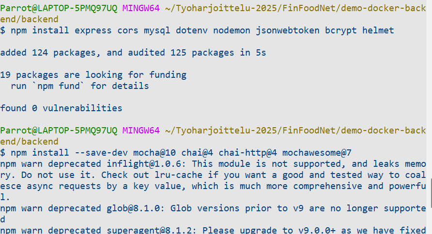 
  

## step 4: basic CRUD backend application with database connection
- The application will follow typical folder structure of:
- src/db/dbconfig.js (connection to database)
- src/db/parrots.js (services to handle parrots datatable)
- src/index.js (the main express application for backend endpoints)
- The dbconfig will be done using "Pool" of mysql2 library. The pool allows multiple simultaneous connections, ensuring scalability. (source: https://www.geeksforgeeks.org/how-to-connect-to-a-mysql-database-using-the-mysql2-package-in-node-js/)
  
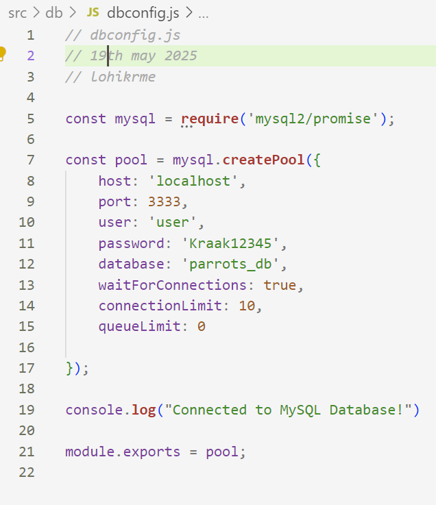 
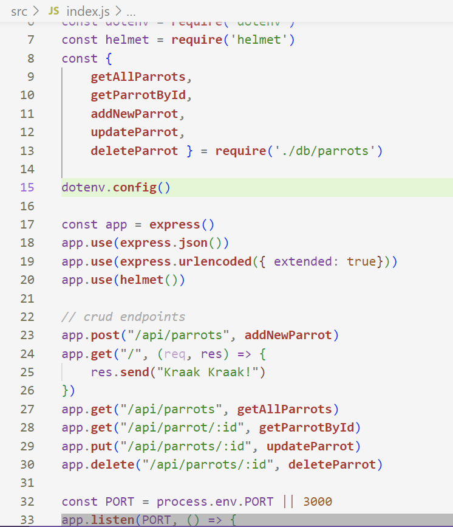 
- 

## step 5: container for backend application
- We must create a suitable Dockerfile that contains a lightweight node image
- And then also update the docker-compose.yaml file, so that it will use for example the environmental variables
- To not install dependencies twice ( straight from file tree and via npm install), use .dockerignore file:

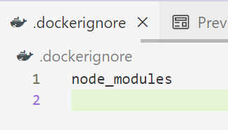 

- Next here is example Dockerfile.backend, that contains node22 image:
  
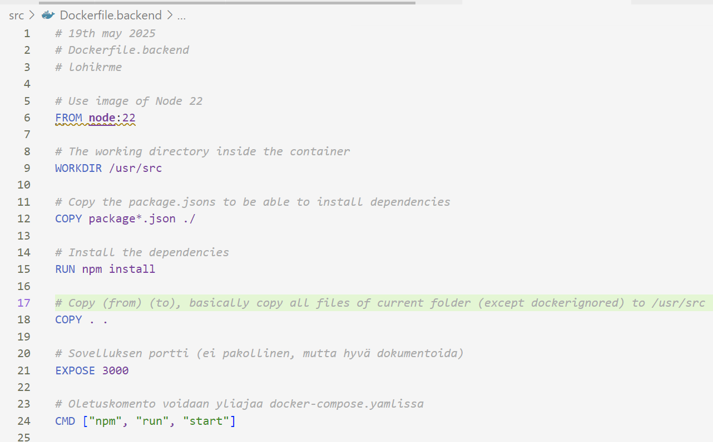 

- And here is the updated part of compose.yaml file:
  
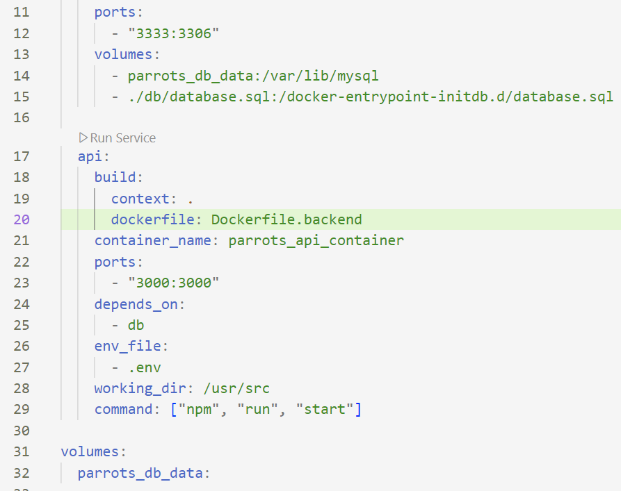 

## step 6: test the functionality of both containers simultaneously
- To test the functionality, we simply run both containers, and make sure no local instances are run the same time, and then if we can with e.g Postman make successful requests to the backend application which will update the database, it was successful